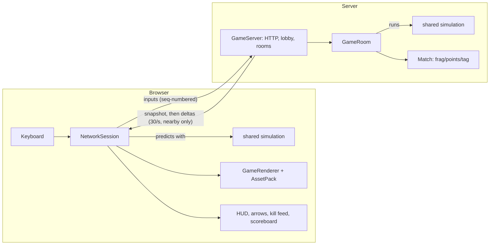

# Mostly Legal Driving Simulator: design

How the game works and why it's built this way. The [README](../README.md) covers playing, running
and hosting; this document covers the design: architecture, rules and numbers, networking, traffic,
and the decisions behind them (including what we chose *not* to do).

Numbers here are the values in the code at the time of writing. When you change a tuning constant,
update the table that mentions it.

---

## 1. Goals and principles

- **GTA2's multiplayer, online, in a browser.** Top-down city, cars, guns, Frag/Points/Tag, the
  arrows pointing at other players. No install.
- **The server is the only truth.** Clients send which keys are down, never where they are. That
  keeps cheating hard and every player's game consistent.
- **One simulation, shared.** The game rules are a plain TypeScript package (`@game/shared`) with no
  rendering or networking. The server runs it for real; the browser runs the same code to predict
  its own player. If they ever disagree, the server wins and the browser corrects itself.
- **Deterministic.** Given the same state and inputs, a step always produces the same result
  (seeded random numbers, no `Math.random` in the simulation, deterministic weapon spread). That's
  what makes prediction and replay work, and it's covered by tests.
- **Looks are swappable.** All graphics go through an `AssetPack` interface; gameplay data never
  lives in a pack.
- **No original GTA2 files**, ever, in the repo or on a server (see [Legal](#legal)).

## 2. Architecture

```
packages/
  shared/   the game: map + city generator, simulation, rules, traffic, protocol, delta encoding
  server/   Node.js: HTTP + WebSocket on one port, lobby, rooms, interest management
  client/   browser: Vite + Three.js, sessions (offline/online), prediction, rendering, UI, assets
docs/       this document
```



- **Fixed tick:** 60 simulation ticks per second everywhere (`TICK_RATE`). The browser renders at
  whatever frame rate it gets and blends between ticks.
- **Offline play** (`LocalSession`) runs the same simulation locally with no server. Same game, no
  match rules.

## 3. World model

- **Units:** one block = one map cell = 1 unit. **+x is east, +y is north, +z is up.** Headings are
  radians, 0 = east, counter-clockwise positive.
- **Entities** (all plain, serializable data in `World`):
  - `Ped`: a player or one of the city's people (`kind`: player, civilian, gangster or cop), with
    `gang` for gang members and `look` (man, woman, youth, worker, elder) for players and civilians.
    Position, heading, health, current weapon and ammo, `carId` when driving, `respawnAt` when dead
    (or arrested), `wanted` level, input edge-detection flags, and `ai` (walking state) for the
    city's people.
  - `Car`: model, position, heading, velocity, health, `driverId`, burning/wreck state,
    `lastAttackerId` (for kill credit), `traffic` (self-driving state) or null, `police` and
    `siren` (lights flashing while chasing or on the way to a fire), `burnsUntil` (a wreck still on
    fire) and `spray` (where a fire truck is spraying water).
  - `Projectile`: bullet or rocket in flight. `Pickup`: weapon crate with a respawn time.
- **Events** (`GameEvent`): impact, explosion, death, carDestroyed, gangAngry, wanted, busted. Produced by a tick,
  used for effects, the kill feed, messages and scoring; they don't change the world themselves.
- **Grudges** (`world.grudges`): which gang is after which player, until when (see [§10](#10-pedestrians-gangs-and-cops)).
- **Wanted** (`world.wanted`): which players the police are after, until when (see [§12](#12-police)).
- **Ids** come from one counter (`nextId`) shared by all entity types.
- **Randomness:** a mulberry32 generator whose state is part of the world (`rngState`), so it's
  copied, sent in snapshots and replayed exactly.

## 4. The map and the generated city

A map is a grid of cells (`BlockMap`):

| Field | Meaning |
|---|---|
| `kinds` | road, pavement, grass, building, water. Buildings and water are solid. Outside the map counts as building. |
| `levels` | building height in storeys (1 storey = 1 unit) |
| `variants` | free per-cell style data for asset packs (building colour, road centre lines) |
| `lanes` | traffic lanes: a bit per driving direction, plus an intersection bit |
| `territory` | which gang's turf a cell is (0: neutral ground) |
| spawns | player spawn points (24), parked cars (28), weapon pickups (16) |

**The generated city** (`generateCity(seed)`) is a 6×6 grid of city blocks, 77×77 cells:
- Roads every 12 cells, **3 cells wide**: an outer lane each way plus an empty middle row (used for
  overtaking). Intersections where roads cross. A ring of pavement around every block.
- Each block: 15% park (grass), 10% plaza (pavement), otherwise split into four buildings of 1–5
  storeys (some become courtyards). A 6-storey wall around the city.
- **Right-hand traffic**: eastbound lanes on the south row of a road, northbound on the east column,
  and so on.
- **Parked cars stand on the pavement along the right-hand kerb**, facing the traffic direction (not
  in the lanes: that jammed traffic, see [§9](#9-traffic)).
- **Pickups**: pistol 3 in 6, machine gun 2 in 6, rocket launcher 1 in 6, spread over pavements.
- **Gang turf**: three corners of 2×2 city blocks (north-west, north-east, south-centre), the blocks
  only, not the roads between them. Fixed, without using the random generator, so a seed's city
  stayed the same when turf was added.
- The same seed always gives the same city, so the server only sends the seed, not the map.

## 5. One simulation tick

`stepWorld(world, inputs)` in this order:

1. **Peds:** edge-detect Enter and weapon switching; skip the dead; enter/exit cars; walk; switch
   weapons and fire.
2. **Cars:** each gets controls from its driver's input, from its traffic driver, or none; then
   physics and wall collisions.
3. **Car-to-car collisions.**
4. **Peds in cars** follow their car; **peds on foot** are pushed out of cars (and run over if the
   car is fast).
5. **Pickups, projectiles, pedestrians** (who see this tick's gunfire), **police** (who's wanted,
   which police cars chase), **fire brigade** (dispatch, missions ending), **lifecycle** (respawns, bodies cleared, burning cars exploding, wrecks
   replaced), **traffic and pedestrian upkeep**.

On the server, the `Match` then scores the tick's events (see [§8](#8-game-modes-and-matches)).

## 6. Movement and cars

**People:** GTA2 "tank" controls: left/right turn (4.5 rad/s), up walks 3 blocks/s, down backs up
at 1.8. Radius 0.18. Enter a car within 0.7 blocks of its edge; get out at up to 4 blocks/s, on the
driver's side if free, else the other.

**Car physics** (arcade, not realistic): velocity is split into forward and sideways parts. Throttle
and brake change the forward part; **grip** bleeds off the sideways part, much more slowly with the
handbrake on, which makes drifting. Steering is proportional to speed (full above 2.5 blocks/s,
reversed when reversing). Walls: the car's outline is sampled at 8 points; movement is resolved per
axis with a small bounce. Cars hit each other as two circles each (front and back).

| Car | Length × width | Top speed | Accel | Turn rate | Grip | Handbrake grip | Health |
|---|---|---|---|---|---|---|---|
| Compact | 1.0 × 0.5 | 11 | 9 | 3.2 | 8 | 1.2 | 80 |
| Sedan | 1.15 × 0.55 | 13 | 8 | 2.8 | 7 | 1.0 | 100 |
| Sports car | 1.1 × 0.55 | 18 | 13 | 3.0 | 9 | 1.4 | 90 |
| Truck | 1.6 × 0.65 | 9 | 5 | 2.0 | 10 | 2.0 | 180 |

(Speeds in blocks/s; the HUD shows ×10 as "km/h".) Not yet modelled: mass (all cars are equally
heavy in a crash), speed-dependent understeer. See roadmap item 4.

## 7. Combat

### Weapons

| | Pistol | Machine gun | Rocket launcher |
|---|---|---|---|
| Damage | 25 | 12 | 150 at the centre of a 1.8 blast, falling off with distance |
| Fire rate | 18 ticks (3.3/s) | 5 ticks (12/s) | 50 ticks (1.2/s) |
| Projectile speed / range | 22 / 14 | 24 / 14 | 11 / 22 (explodes at the end) |
| Spread | ±0.01 rad | ±0.07 rad | none |
| Ammo per pickup / max | 30 / 99 | 80 / 300 | 5 / 20 |

- **Projectiles are real objects**, like GTA2's visible bullets, moving in 3 substeps per tick so they
  can't skip through thin things. They hit walls, cars and peds on foot (never their shooter).
- **Spread is deterministic** (a hash of tick and shooter), so server and predicting client agree.
- **Pickups** respawn 10 s after being taken; you can't take more than the maximum ammo. Players start
  unarmed. Running out of ammo switches to the next weapon. No shooting from cars.

### Damage, death and cars

| What | Effect |
|---|---|
| People | 100 health. Pistol kills in 4 hits, machine gun in 9, a direct rocket hit outright. |
| Bullets on cars | half damage |
| Run over | (impact speed − 3) × 30, so fatal from about 6.3 blocks/s; credited to the driver |
| Crashes | wall: (speed − 5) × 6; car-to-car: (closing speed − 5) × 5 to both, each credited to the other driver |
| Dying | out of the car, weapons dropped, respawn after 3 s at a random spawn point |
| Car at 0 health | burns for 3 s (time to get out), then explodes: driver dies, 150 damage in 2.5 blocks, a wreck that burns for up to 25 s (unless the fire brigade puts it out) and is replaced by a fresh car after 30 s (at least 10 s after the fire is out) |
| Car destroyed by a rocket | explodes 0.3 s after the rocket: two separate booms feel stronger than one |
| Car caught in another car's explosion | burns first, so chain reactions go off one after another |
| Kill credit | whoever last damaged a car is credited for its explosion, even if its driver then crashes it |

## 8. Game modes and matches

| Mode | Scoring | Default limit |
|---|---|---|
| Frag | +1 per kill, −1 for killing yourself | first to 10 |
| Points | +1,000 per kill, −500 for killing yourself, +100 per car you wreck, +10 per pedestrian | first to 10,000 |
| Tag | time alive as "it" | first to 2:00 |

- Accidents (no killer) only count as a death. If nobody reaches the limit, the leaders when time
  runs out (default 10 minutes) win; ties have several winners.
- **Tag:** a random player starts as "it"; whoever kills "it" becomes "it". "It" can't pick up weapons
  (crates look disabled for them), sees no arrows, and their car takes double damage. Hunters see
  only the arrow to "it". Accidents and suicides don't pass "it" on. "It" is stored in the world, not
  just the match, because it changes the simulation (pickups, damage).
- **Between matches:** 10 s intermission, everyone frozen (the client predicts no input too), then
  scores reset and everyone respawns unarmed. `MODE=rotate` plays the three modes in turn.

## 9. Traffic

Cars that drive themselves (`traffic.ts`, part of the shared simulation).

- **Same controls as a player:** a traffic driver produces the keys a player would press, so traffic
  follows exactly the same physics.
- **Route:** a short list of waypoints along its lane. At an intersection it picks straight on
  (weight 2), left or right (weight 1 each), using route templates for "arriving eastbound" rotated
  to the actual direction; exits that don't lead into a matching lane are skipped.
- **Driving:** aims 1.1 blocks ahead along the route, cruises at 4.5 blocks/s, 2.6 in turns (slowed
  down from 6 and 3.2 after playtesting: traffic felt too fast; flow didn't suffer, see below).
- **Braking:** stops for any car or person in front, within 1.2 blocks plus a speed-based margin.
- **Right of way:** checked from two cells before an intersection. Cars approaching or inside it take
  turns; the one closest to the centre goes first (ties: lower id), so two cars never wait for each
  other forever.
- **Overtaking:** stopped for 0.75 s behind something that isn't moving and isn't traffic (a parked
  car, a wreck, someone standing in the road), it swings into the empty middle row, passes, and pulls
  back in. Not past an obstacle at an intersection; once past, it may carry on straight through an
  intersection in the middle row.
- **Getting unstuck:** blocked for 4 s anyway, or not moving for 1.5 s while wanting to, it backs up
  for 0.8 s and finds its lane again. If there's no lane nearby, it drops out of traffic and stays
  parked.
- **Takeover:** getting into a traffic car makes it yours. Its driver is pulled out: a civilian
  appears at the driver's door (or the other one, if that's blocked) and runs away from you for 4 s,
  then carries on as an ordinary pedestrian. Only the server knows which cars are traffic, so a
  client's prediction just gets in; the driver shows up with the next snapshot.
- **Fire:** the driver of a traffic car that catches fire bails out the same way, running from the
  car, and gets clear before it blows (3 s). The car rolls to a stop. A car blown up by a rocket
  (0.3 s) takes its driver with it: no time to get out.
- **Numbers:** a target per room (`TRAFFIC`, default 16). Missing traffic is added one car per tick
  at a free lane cell at least 14 blocks from every player, so nobody sees it appear. Total cars are
  capped so dropped-out traffic can't fill the city.

**Measured over 3 minutes in three cities**, after tuning: on average about 14 of 16 traffic cars
moving, at the worst moment 6–12, about 5 minor bumps. (The first version gridlocked within 30 s
behind cars parked in the lanes; overtaking, kerb parking and right of way fixed that.)

Not done: traffic lights, visible drivers, traffic on custom maps (needs lane data).

## 10. Pedestrians, gangs and cops

The people walking the city (`pedestrians.ts` and `gangs.ts`, part of the shared simulation).
They're peds like players, so they can be shot and run over by the same rules. There are three
kinds: **civilians** (described first), **gang members** and **cops** (further down).

- **Walking:** cell by cell along the pavements at a stroll (1.4 blocks/s; elderly people 0.6×,
  youths 1.15×): mostly straight on, sometimes turning (weights 6 : 2 : 2), back only at a dead end,
  and now and then stopping for 1–3 s (3% per cell). **Looks:** man, woman (3 in 11 each), youth,
  worker (2 in 11 each), elder (1 in 11). Players get a look too, by join order.
- **Stuck:** no progress towards the next cell for 45 ticks (a wall, a car parked on the pavement)
  and they pick another way. Progress is measured from tick to tick: a parked car pushes them back
  after their step, so measuring within the step never saw them stuck.
- **Crossing:** at the kerb facing a road they sometimes cross (20% chance), straight over to the
  pavement opposite, not at intersections, and only when no moving car is within 8 blocks; they walk
  briskly (2.2) while on the road. Traffic stops for them anyway (see [§9](#9-traffic)).
- **Panic:** impacts, explosions, deaths and bullets or rockets flying past within 7 blocks make them
  run (3.2 blocks/s) for 4 s, to the open cell furthest from the danger, preferring off the road. A
  car heading straight at them (faster than 4, within 4.5 blocks, its path within 0.8 of them) makes
  them jump sideways out of its path, onto the road if need be. Afterwards they walk back to the
  nearest pavement, avoiding the traffic lanes where possible.
- **Bodies:** a body within 4 blocks, in plain sight, that they haven't noticed before makes a
  civilian stop and stare at it for 1.5–3.5 s, facing it (60%), or hurry away as if from danger
  (40%). Not while running, crossing the road or already staring. Each remembers the last 4 bodies
  they noticed (or saw being killed, which makes them run anyway), so a body startles them once.
  Measured with 15 bodies in 5 busy cities over 20 s: 11 passers-by stared, 4 hurried away, 4 cops
  came to look, nobody got stuck looking.
- **Not players:** they can't pick up weapons or enter cars; no frags (killing one is worth 10 points
  in Points mode, a gang member 20, a cop 50); no ring, arrow, name tag or kill feed line (unless they
  kill a player: then the feed names their gang, or "A cop").
- **Bodies** stay for 20 s, then are cleared. **Numbers:** a target per room for each kind
  (`PEDESTRIANS` civilians, default 40; `GANG_MEMBERS` per gang, default 6; `COPS`, default 6);
  missing ones appear (one of each kind per tick) on a free pavement cell at least 14 blocks from
  every player; gang members on their own turf.

**Gangs** (names are our own): *The Suits*, *The Lab Rats* and *The Undead*, each with its turf
(see [§4](#4-the-map-and-the-generated-city)) and look.

- **On their turf:** members walk like civilians but only onto their own turf's pavement, crossing
  the road only to their own blocks. A member who strayed (chasing someone, dodging a car) prefers
  the ways that take them closer to home (5× weight), crossing roads only towards it. Measured:
  95% of the time on their turf, 1% more than 3 cells off it (the rest crossing between blocks).
- **Fearless:** gunfire, explosions and bodies don't bother them (nor cops); a car coming at them
  makes them jump aside for 1 s only, so they don't end up far from home.
- **Armed** with a pistol (99 rounds), which they keep holding.
- **Grudges:** a player who hurts a member (shooting, a blast, running them over) makes the whole
  gang angry with them for 30 s, refreshed by any further harm. A new grudge is announced
  (`gangAngry` event, sent to that player wherever they are: "The Suits are after you!"). Only
  players cause grudges; hurting each other or accidents don't.
- **Retaliation:** members within 15 blocks of a player their gang is after drop everything: with a
  clear line of sight within 10 blocks they turn, aim for 0.5 s, then fire about every 1.25 s, up to
  0.16 rad off; otherwise they run straight at the player. Measured standing still in the open next
  to a hurt member: first hit after about 3 s, dead after about 9 s (median of 12 runs): enough time
  to run, deadly if you don't.

**Cops** walk the whole city like civilians, armed and fearless, in navy. A body they notice they
walk straight over to (to within 1 block) and look at for 4 s, then carry on. What they do about
crime: see [§12](#12-police). Gang members ignore bodies.

- **Network:** their walking state isn't sent; like traffic they only go to nearby players, and so do
  their deaths.

**Measured over 15 simulated city-minutes** (16 traffic cars, 40 pedestrians, five cities): on the
pavement 97% of the time, none run over by traffic, everyone keeps moving (about 150 blocks each in
3 minutes). A full city costs about 0.45 ms per simulation tick; 0.5 ms with gangs and cops (65
people). (The first versions lost 12
pedestrians to traffic in that time: panicking and returning pedestrians took the shortest way, often
along a lane; and the danger check reacted to traffic merely driving past.)

## 11. Fire brigade

`fire.ts`. Wrecks keep burning after the explosion; fire trucks come to put them out.

- **Fires:** a wreck burns for 25 s, or until it's put out. A car that has only just caught fire
  (3 s before it blows) isn't a job for the brigade: it's gone before anyone could get there.
- **Dispatch:** every half second, each burning wreck no truck is dealing with gets one, up to
  `FIRE_TRUCKS` (default 2) out at once. The truck appears on a lane 12–40 blocks from the fire
  and at least 16 from every player, so nobody sees it appear, with its lights flashing.
- **Driving there:** the same driving as chasing police cars (`navigate.ts`): straight at the
  fire when in plain sight, otherwise along the roads, backing up when stuck; up to 9 blocks/s,
  slowing down on the way in so it stops short of the flames.
- **Putting it out:** within 3.5 blocks it stops and sprays water (`spray`, drawn as an arc of
  drops) for 2.5 s; the fire is out. Not there within 60 s: it gives up.
- **Afterwards:** it drives off at a calmer 5 blocks/s towards a road 25+ blocks away (its
  station) and disappears once no player is within 16 blocks. Fire trucks never park or join the
  traffic otherwise.
- **Stealing one:** like any traffic car (its driver gets out and runs); the fire is then on its
  own. Its model is a truck with fire-engine stats (long, slow to accelerate, 220 health).
- **Looks:** the Car Kit's fire truck, with the police car's flashing lights on the roof (the
  placeholder pack draws a red truck).
- **Measured** (10 cities, a parked car blown up 5 blocks from a player): truck out 0.5 s after the
  explosion, spraying after 5–17 s (typically 5–6), fire out 2.5 s later, truck gone 4–15 s after
  that.

## 12. Police

`police.ts`, following the plan in [POLICE.md](POLICE.md) (step 1 of it is built: heat, wanted
levels and the response up to three stars; SWAT, roadblocks and the army are to come).

- **Police on the streets:** police cars drive around with the traffic (`POLICE_CARS`, default 2;
  sedans with a crew of two, drawn as the Car Kit's police car) and cops patrol on foot (`COPS`).
- **Room option** (`POLICE`, or chosen when creating a room): `on` (the default, up to the army),
  `noarmy` (stops at five stars) or `off` (no cops, police cars or bribes, and nothing is a crime).
- **Heat and stars:** crimes add heat; heat sets the wanted level: 1 star from 10, 2 from 30, 3
  from 60, 4 from 100, 5 from 150, the army from 220. Only players commit crimes, and **killing
  other players is not one** (that's the game).

  | Crime | Heat | Counts |
  |---|---|---|
  | Shooting | 2 per second of firing | only when seen |
  | Hitting someone with a car | 5 (at most twice a second) | only when seen |
  | Stealing a car with its driver in it | 10 | only when seen |
  | Wrecking a car | 10 | only when seen |
  | Killing a pedestrian or gang member | 15 | only when seen |
  | Ramming a police car (over 1 block/s), hurting a cop or a police car | 10 (at most once a second) | always |
  | Stealing a police car | 20 | always |
  | Killing a cop, wrecking a police car | 40 | always |

  "Seen": a cop on foot or a crewed police car within 12 blocks, in plain sight. A new star is
  announced with a `wanted` event (a toast); the HUD and other players' name tags show the stars.
- **Losing stars:** out of the police's sight for 25 s the top star goes, then one more every 15 s
  (each time down to the start of the level below). Being seen resets the countdown. Dying or
  getting busted clears everything. **Cop bribes:** three crates per city (picked last by the map
  generator, so cities didn't change) take a star off at once; only a wanted player takes one, and
  it's back after a minute.
- **The response:**
  - 1 star: police cars within 20 blocks give chase (lights flashing), cops on foot within 15
    run after the suspect. No shooting.
  - 2 stars: every police car in the city gives chase, plus 2 reinforcements (4 from 3 stars; at
    most 8 per room), which appear on a road 15–40 blocks away, out of every player's sight, and
    disappear again (out of sight) once they're not needed. Cops within 25 blocks join in, and shoot
    back at a suspect who has been shooting (in the last 10 s, where the police saw it).
  - 3 stars: cops shoot on sight; police cars ram (below three stars they keep pace behind a
    moving suspect instead).
  - 4 stars and up: no more arrests, only shooting (until SWAT and the army come in later steps).
- **Chasing** is shared with the fire brigade (`navigate.ts`): straight at the suspect in plain
  sight, otherwise along the roads (a breadth-first search over road cells, redone every half
  second), up to 10 blocks/s (4 in turns), backing up when stuck. Once the suspect is within 4
  blocks and (nearly) stopped, or on foot, the car pulls up and both cops get out.
- **Cops shooting** works like gang members: half a second to aim, a shot every 1.25 s, up to
  0.16 rad off, from up to 10 blocks (not when the suspect is within 4 blocks and can be grabbed).
  Players killed by the police died in an accident: a death, nobody's frag.
- **Arrest:** a cop who reaches a suspect on foot, or in a car going under 1 block/s, holds on for
  a second (`beingArrested` shows it: "A cop has got you"). Getting out of reach (walking off,
  driving off) breaks free and shakes the cop off for a second; staying put: BUSTED (`busted`
  event, sent to everyone). Out of their car, weapons gone, taken away (not drawn, not a body) and
  back after 3 s like a respawn. It counts as a death on the scoreboard (nobody's frag) and costs
  250 points in Points mode. Cops thrown out of their stolen police car need a second to get up, too.
- **Measured** (6 cities each, a player standing still): 1 star: busted after 5–21 s, or nobody
  close enough came; 2 stars: busted after 4.5–9.5 s; 3 stars: busted or shot after 4–7 s; 4 stars:
  shot after 6–9 s. A full city still costs about 0.45 ms per tick.
- **Network:** chasing is decided on the server only (traffic state isn't sent); clients see
  `siren`, `wanted` and `beingArrested`.

## 13. Networking

### Messages (JSON over one WebSocket)

| Client → server | |
|---|---|
| `join {name, roomId?}` | join a room (the default room without an id) |
| `createRoom {name, room}` | create a room (name, mode, limits) and join it |
| `input {seq, input}` | one tick of keys, sent every client tick |
| `ping {time}` | latency measurement |

| Server → client | |
|---|---|
| `rooms` | the lobby's room list (on connecting, then when it changes, at most once a second) |
| `joinFailed {reason}` | full, gone, too many rooms |
| `welcome` | your ped id, the room, the city seed, tick and snapshot rates |
| `snapshot` | the full state you can see, plus scores, match state, acks and events |
| `delta` | what changed since your previous snapshot or delta |
| `pong` | |

All client messages are validated (`parseClientMessage`): unknown types and malformed fields are
dropped, names are cleaned up (whitespace collapsed, control characters removed, 16 characters for
players, 24 for rooms), room settings are clamped, and messages over 1 KB are refused.

### Inputs and authority

- Every input carries an increasing sequence number. The server queues them per player (up to one
  second's worth) and applies **exactly one per tick, in order**; if a player's queue runs dry it
  repeats their last input. Duplicates and out-of-order inputs are ignored.
- Each snapshot reports, per player, the last input applied (`acks`).

### Snapshots, deltas and what each player gets

- The server sends 30 updates a second (every 2 ticks).
- **Deltas:** after one full snapshot, each player only gets what changed since what *they* were sent
  last: new entities in full, changed entities with only the changed fields, removed ids. Scores and
  match state only when they change. WebSocket delivery is reliable and in order, so no extra
  acknowledgements are needed.
- **Rounding:** numbers are rounded to 0.0001 before sending; the server keeps full precision.
- **Interest management:** each player gets the area around them: ±16 blocks on foot, growing with
  driving speed (+0.9 per block/s, up to ±32) because the camera zooms out. Always included: every
  player and the car they drive (arrows, name tags), all pickups, players' deaths and wrecked cars
  (kill feed, scoring). Pedestrians, their deaths, sparks and explosions only when nearby. Traffic's
  and pedestrians' AI state is never sent.

**Measured bandwidth per player** (4 players):

| Situation | Data per player |
|---|---|
| First version: full JSON snapshots, standing still | 245 kB/s |
| Deltas, standing still / everyone moving + machine gun | 5 / 18 kB/s |
| 4 players walking, no traffic | 9.5 kB/s |
| … with 16 traffic cars, everything sent | 50 kB/s |
| … with 16 traffic cars, nearby only (now) | 13.5 kB/s |

### Prediction and reconciliation (your own player)

- The browser applies each input to its own copy of the world straight away (instant controls) and
  sends it. When a snapshot arrives, it resets that copy to the server's state and replays the
  inputs the server hasn't acknowledged yet.
- Your ped, your car, your own projectiles and the pickups are drawn from the prediction.
- **Smooth corrections:** if replaying moves you, the difference fades out over ~0.1 s instead of
  snapping (`CorrectionSmoother`). Jumps over 2 blocks (respawning) are shown at once.

### Everyone else (interpolation)

- Other players, traffic and their bullets are drawn **100 ms in the past**, blended between the two
  buffered snapshots around that moment (`SnapshotBuffer`). That hides late or lost snapshots (up to
  two in a row).
- The client estimates the server clock from the *earliest*-arriving snapshots, drifting back only
  slowly, so one late packet doesn't make everything jump back.
- Other players' bullets are kept for a moment after the server removes them, so they don't vanish
  100 ms before hitting something.
- **Effects** from your own shots show as soon as the server reports them; everyone else's are timed
  to match the delayed drawing.

### Deliberately not (yet) done

- **WebRTC / WebTransport** (UDP-like transport): needs extra infrastructure (certificates, relay
  servers) and mainly helps on lossy connections. Revisit after playtesting over the internet.
- **Lag compensation for hits:** much less important with visible, dodgeable projectiles than with
  instant-hit weapons.
- **Binary encoding:** JSON plus deltas was enough so far.

## 14. Rooms and the lobby

- One server hosts many **rooms**, each its own game with its own random city, match and players.
  One permanent room ("Downtown", configured with `MODE`, `SCORE_LIMIT`, `TIME_LIMIT`); rooms players
  create close a minute after their last player leaves. Max 8 players per room, 20 rooms.
- One room per connection. Names only need to be unique within a room ("dave" → "dave 2").
- **Invite links:** after joining, the address bar reads `…/#room=<id>`; opening it joins that room.
  Esc leaves (and drops the room from the address).

## 15. The browser client

- **Sessions:** `LocalSession` (offline) and `NetworkSession` (online) give the rest of the client the
  same interface: a world to draw, where to draw each entity this frame, and events to show.
- **Rendering:** Three.js with a perspective camera looking straight down (60° across the shorter
  screen side), so tall buildings lean outwards like GTA2. The camera rises with speed (11 blocks up
  on foot, up to 26) and looks ahead of a moving car (0.35 s of travel).
- **Asset packs** (`AssetPack`): build the map, and create views for cars, peds, projectiles, pickups
  and effects. Views get the entity's state every frame.
  - `KenneyPack` (default): Kenney's CC0 art. 3D Car Kit models fitted to each car's exact size;
    Top-down Shooter characters with a pose per weapon and a ring in the player's colour; ground
    tiles; bushes on grass; buildings stacked per storey with windowed facades and seamless roofs
    drawn in code; crates with weapon icons.
  - `PlaceholderPack` (`?pack=placeholder`, and the fallback if the art fails to load): coloured boxes.
  - Shared helpers (`assets/common.ts`): car smoke and flames, blood pool, the walk animation.
- **Walk animation:** GTA2-style feet stepping out in front and behind, the upper body swaying, driven
  by distance moved on screen (one cycle per 0.9 blocks), so it works for predicted and remote peds
  alike and feet never slide.
- **UI:**
  - **Lobby:** name, live room list, create-room form, offline play.
  - **In the game:** HUD (health, weapon, controls, status), name tags, and GTA2-style arrows: an
    outlined block arrow in the player's colour circling your character, pointing at each living
    player.
  - **Match and feedback:** match status, kill feed, Tab scoreboard and winner screen, WASTED screen
    with cause and countdown, and a message when "it" steps on a crate.
  - Player names are only ever inserted as text, never as HTML.
- **Controls:** arrows/WASD move and steer, Enter/F enter and exit, Space handbrake, J/Ctrl fire, Z/X
  switch weapon, Tab scores, Esc leave.

## 16. Hosting and operations

- One Node process serves the built client, `/healthz`, and the game's WebSocket on one port
  (`npm start`). The page connects back to its own address (`wss://` on HTTPS).
- **Run exactly one instance:** rooms live in memory, and a restart ends all games.
- Docker image (`Dockerfile`), Railway config (`railway.json`, step-by-step in the README). Vercel was
  considered and rejected for the server: serverless functions can't hold WebSockets or run a 60 Hz
  loop with in-memory rooms. Railway's Hobby plan (about $5 a month) or Render ($7) fit.
- Environment: `PORT`, `SEED`, `MODE`, `SCORE_LIMIT`, `TIME_LIMIT`, `TRAFFIC`, `PEDESTRIANS`,
  `GANG_MEMBERS`, `COPS`, `POLICE_CARS`, `FIRE_TRUCKS`, `STATIC_DIR`.
- Static files are served only from inside the build folder (path-traversal attempts are refused).

### Legal

Rockstar still owns GTA2's art, sound, maps and name. The game ships only CC0 art (Kenney) and art
drawn in code; `.sty`/`.gmp` files are gitignored. A future "classic" pack would load a player's own
GTA2 files in their browser, never uploading or hosting them. The game's name is its own.

## 17. Testing

- `npm test` runs node:test suites in all three packages; `npm run typecheck` checks all code.
- **Simulation:** movement, collisions, combat, damage, deaths, matches, traffic, pedestrians,
  gangs (turf, grudges, retaliation, chasing), cops, police (crimes, chases, arrests, giving up),
  fire brigade (fires burning out, dispatch out of sight, spraying, leaving, limits, stealing),
  delta encoding, and
  **replay determinism** for each of them (a copied world fed the same inputs must end up identical).
- **Server:** real WebSocket clients against a real server (joining, input ordering, rooms, limits,
  deltas decoded like the real client does, HTTP serving and path traversal, interest management).
- **Client:** snapshot interpolation, correction smoothing, arrows, the walk animation, and
  end-to-end tests of the real `NetworkSession` against a real server (prediction, no double-drawn
  bullets, events reaching both players).
- **Measure before tuning:** bandwidth, tick cost and traffic flow were measured with throwaway
  scripts and the results are recorded above.

## 18. Decisions log

| Decision | Why |
|---|---|
| TypeScript everywhere, one shared simulation | Server and client can't drift apart; prediction needs the exact same code |
| Three.js 3D view instead of a 2D engine | GTA2's leaning buildings come for free from a perspective camera |
| Authoritative server, inputs only | Consistency and cheat resistance |
| JSON + deltas + interest management, not binary | Simple to debug; measured to be small enough (5–20 kB/s per player) |
| Projectile weapons, no hit lag compensation (yet) | GTA2's bullets are visible and dodgeable |
| Parked cars on the kerb | Cars parked in lanes gridlocked traffic |
| Traffic drives with player controls | Same physics for everyone, no special cases |
| "It" stored in the world | It changes the simulation, so prediction must know it |
| Pedestrians are peds with `kind` and `ai` | Shooting, running over, bodies and physics work for them unchanged |
| Pedestrians dodge cars sideways, ignore passing traffic | Measured: fleeing "away" or reacting to any nearby car got them run over |
| Fire trucks put out burning wrecks, not burning cars | A car blows 3 s after catching fire: no truck could get there in time |
| Ramming a police car makes you wanted at once | Playtest feedback |
| Heat and stars, minor crimes only when seen | GTA2's model; small crimes add up, attacks on the police always count (POLICE.md) |
| Killing players is no crime | The police shouldn't punish playing the deathmatch (decided after the analysis) |
| Arrest takes a second you can break away from | Escapes possible, arrests deliberate (decided after the analysis) |
| Busted = taken away, back after 3 s, weapons gone | Like a respawn, but without a body |
| Traffic drivers exist only when they get out | No ped to carry around in every traffic car; spawned at the door when needed |
| Gangs: fixed turf plus per-player grudges | Like GTA2's gang respect, but simple: hurt one, the gang is after you for a while |
| Gang aim: 0.5 s to aim, a shot every 1.25 s, 0.16 rad off | Measured: tighter aim killed a player standing still in 2–4 s, looser took 15–25 s |
| Cops in the blue-shirted sprite, tinted navy | Tinting the soldier sprite blue only made it darker green |
| Rocket-destroyed cars blow 0.3 s after the rocket | Two booms feel more powerful than one merged explosion (playtest feedback) |
| Kenney CC0 art as default | Free to ship and host; no GTA2 assets |
| Arrows orbit the player, outlined | Placement from GTA2; the bevelled look felt too old-fashioned (playtest feedback) |
| Railway/Render, not Vercel | Needs a long-running process with WebSockets |
| Name: Mostly Legal Driving Simulator | Avoids Rockstar's "Grand Theft Auto" trademark |

**Tried and dropped or postponed:**

- **Jumping** (Space on foot, sailing over cars): built, then dropped at the user's request. Kept in a
  `git stash`.
- **In-browser map editor:** started (a validated map file format), then postponed. Kept in a
  `git stash`; the plan is in the project notes.
- **Classic GTA2-files pack, car mass and handling:** on the roadmap for later.

## 19. Known limitations and next steps

- The rest of the police (POLICE.md steps 2–4): roadblocks and SWAT, the army (tank, soldiers,
  helicopter).
- A co-op game mode, everyone together against the police (TODO, after the full police).
- Chasing police cars don't avoid other cars and only know the roads, not shortcuts across pavements.
- Gang members don't drive, don't fight each other, and chase in a straight line (no path finding).
- Points popping up where they're earned, like GTA2.
- Traffic only on generated cities; no traffic lights.
- No mass in car crashes; no speed-dependent understeer.
- A misprediction while bumping into another player's car shows as a short glide.
- WebRTC/WebTransport and hit lag compensation: after playtesting over the internet.
